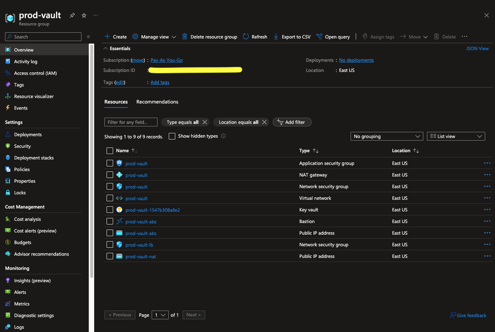
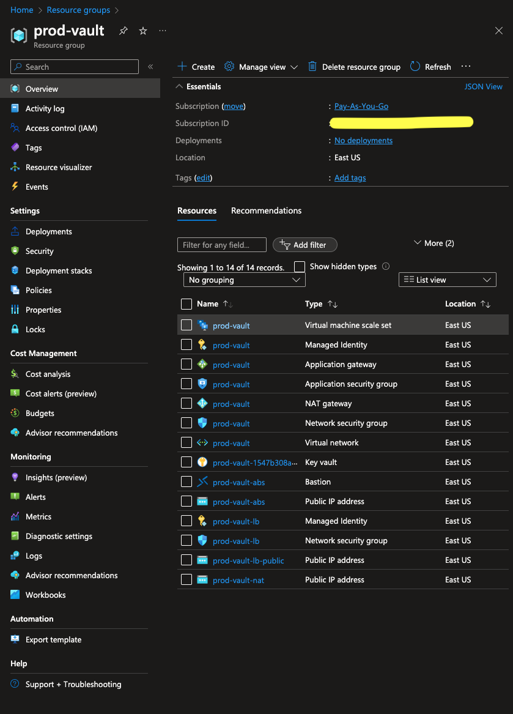
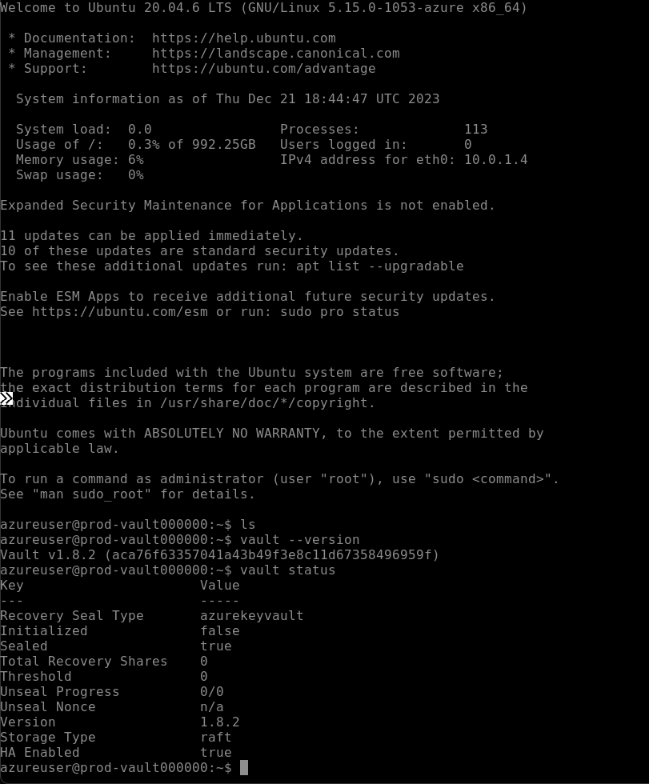
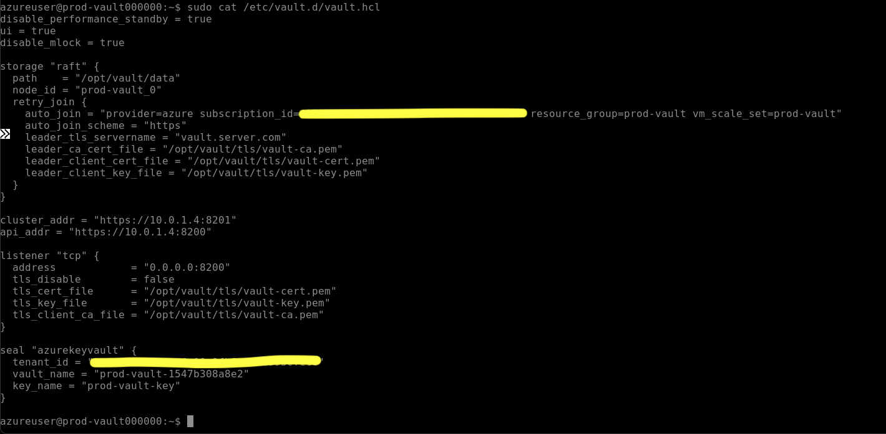
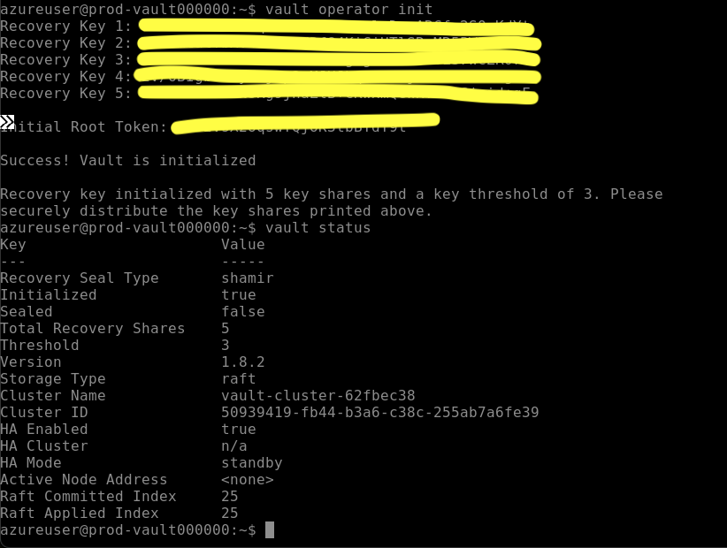
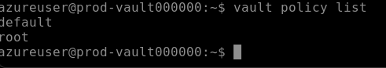
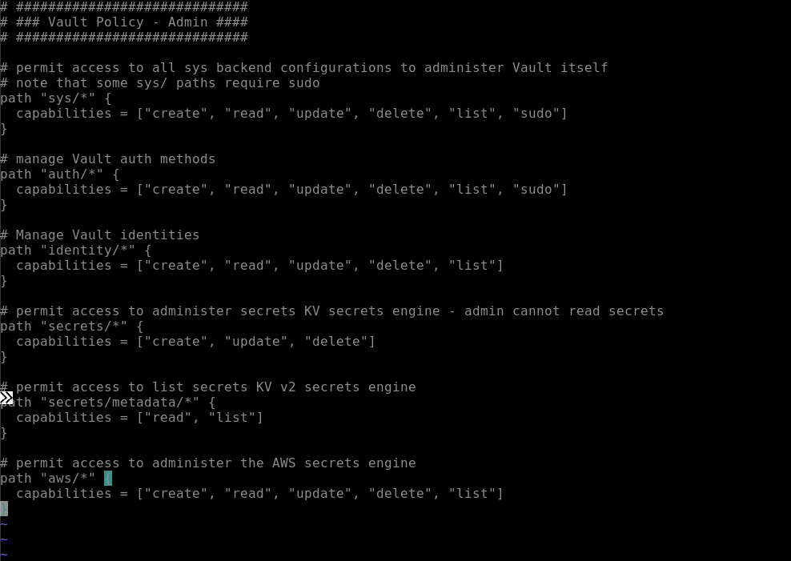
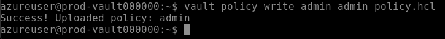
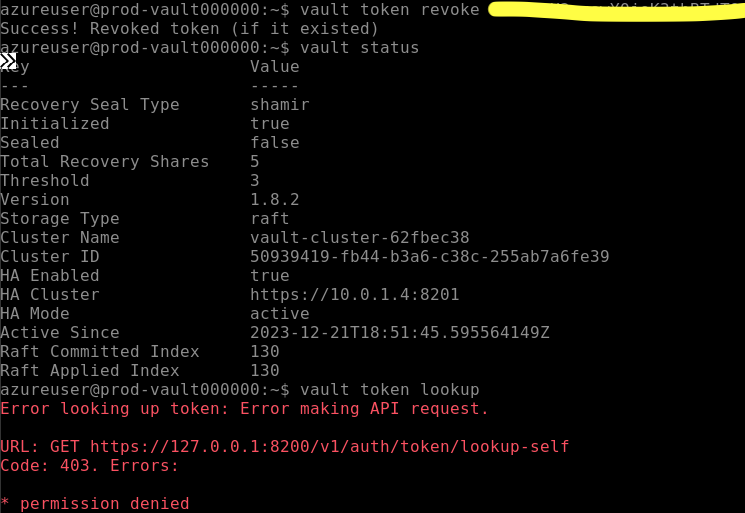

# Deploying HashiCorp Vault Reference Architecture With Terraform

HashiCorp has created a reference architecture for deploying Vault, and can be viewed on their website here:  [https://developer.hashicorp.com/well-architected-framework/zero-trust-security/raft-reference-architecture](https://developer.hashicorp.com/well-architected-framework/zero-trust-security/raft-reference-architecture)

To make it easier to adopt they also created a Terraform module that builds out the architecture in your cloud environment of choice.

The module is available for reference on the terraform registry here: [https://registry.terraform.io/modules/hashicorp/vault-starter/azure/latest](https://registry.terraform.io/modules/hashicorp/vault-starter/azure/latest)

The module expects certain resources to already exist in your environment (such as resource group, networking, KeyVault, etc), but they also provide Terraform config to deploy these as well.

Inside the Github repo for this module, there’s a folder for deploying the prerequisites: [https://github.com/hashicorp/terraform-azure-vault-starter/tree/main/examples/prereqs_quickstart](https://github.com/hashicorp/terraform-azure-vault-starter/tree/main/examples/prereqs_quickstart)

You just have to login to the az commandline tool, set your resource naming prefix if you want it, and then do a terraform init and terraform apply.

The prerequisites quickstart gets everything setup that the reference architecture module requires. The result looks like this:

The main things they get you setup with are a virtual network with the proper network paths setup, a keyvault with access policies, a secret key for using auto unseal, and a certificate for TLS. They also include the optional bastion setup so you can securely ssh into your vms from the browser.

With the prerequisites created, we can utilize the module to deploy the reference architecture.

Create a new directory and [main.tf](http://main.tf) and import get the module setup according to the docs.

The values required as input for the module are conveniently output from the prerequisites terraform apply so we can make use of copy paste for most of that.

Then run terraform init and terraform apply.

The resulting resource group looks like this:

The key piece is the virtual machine scale set that provisions 5 linux virtual machines to act as our cluster. Vault is already installed and ready to use. The cluster communication is already setup. After initialization, one node is dedicated as the primary and the others are secondary. The primary services all the writes and the secondaries help with the read throughput and provide extra availability if the primary goes down.

Now the you have to initialize your vault cluster. This is typically done as a ritual with the whole team where you can get the PGP keys for whoever is going to hold the recovery keys so you can encrypt and distribute those.

First SSH onto the machine.

You can check the status and see it’s sealed an not initialized. The version is 1.8 which is not up to date with the current 1.15, but it will work for now.

Let’s view the config:

The cluster is configured with tls enabled, ui enabled, integrated storage, auto_join setup for the scale set, and auto unseal with Azure KeyVault. This is a standard setup. Let’s initialize the vault.

You can see our vault is initialized and because we have auto unseal, we are also unsealed.

If you log into the other machines in the cluster, you can see they will also be initialized and unsealed and ready to service reads.

At this point you can login and start doing your initial configuration like setting up your admin policies and auth methods. Once you do the basic setup with your root token, it’s best practice to revoke that root token so no one has root privileges.

I’ve logged in as root and see only the default policies

I’ll craft a sample admin policy and write it

Next you should enable at least one auth method. I’ll do userpass for simplicity, but you could use LDAP or OIDC, whatever works for your organization. When I create the user, I’ll assign a token policy of admin so when I login I’ll have the admin policy and the default policy.

Now that I have a way to get back in and administer the system, we revoke our root token.

We can always create another one if requires with our recovery keys.

Now we have a production vault cluster that is ready to scale for the organization. We have a good architecture, permissions for our admins to begin setting up additional policies, auth methods, secrets engines, and onboarding apps.